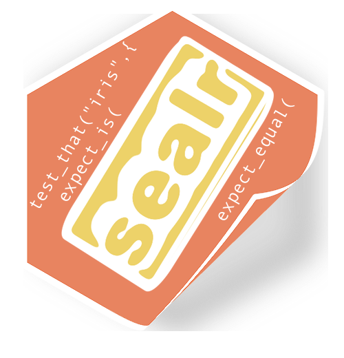
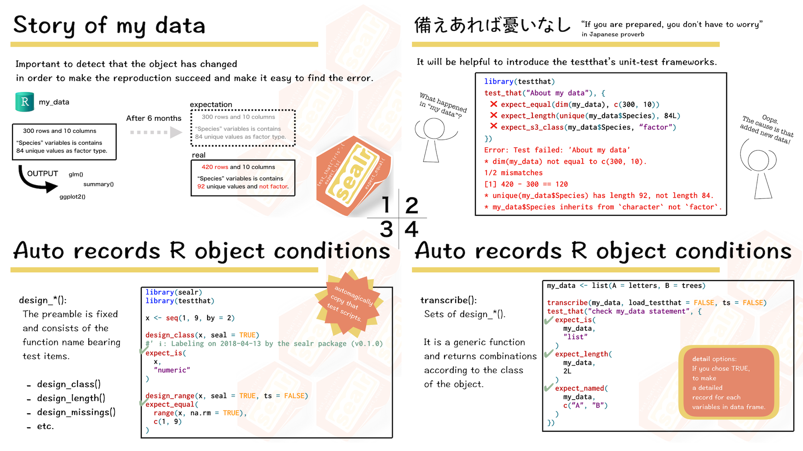

<!-- README.md is generated from README.Rmd. Please edit that file -->

```{r setup, include = FALSE}
knitr::opts_chunk$set(
  collapse = TRUE,
  comment = "#>",
  fig.path = "man/figures/README-",
  out.width = "100%"
)
```
# sealr 

[](https://cran.r-project.org/package=sealr)
[](https://cran.r-project.org/package=sealr) [](https://cran.r-project.org/) [](http://depsy.org/package/r/sealr) 

[](https://travis-ci.org/uribo/sealr) [](https://codecov.io/github/uribo/sealr?branch=master)
 
[](https://www.tidyverse.org/lifecycle/#experimental) [](https://github.com/uribo/sealr)

## Motivation



Data is not always what you think. Someone may change a single value or the data type may be different depending on the specification the API. We need to be aware of these data changes as soon as possible (*It is hard to review from the final result!*).

You can use tests and asserts to check data behavior. Although the testthat package is originally used for unit test of R package, this framework is wide and applicable to any *R* object. On the other hand, it is time-consuming task to enter the state of existing objects, and there is a possibility of mistakes as well.

The goal of **sealr** is to reduce the burden of writing unit tests and assertion that record the state of objects. Applying a function of sealr to the target object outputs the test code that record the current state.

## Installation

**sealr** is available on CRAN.

```{r, eval = FALSE, echo = TRUE}
install.packages("sealr")
```

For developers, install from GitHub.

```{r, eval = FALSE, echo = TRUE}
install.packages("devtools")
devtools::install_github("uribo/sealr")
```

## How to use

1. (As usual) Create an *R* object.
2. Execute the function of sealr (`design_*()` or `transcribe()`) against a object whose state is to be record.
    - `design_*()`... The preamble is fixed and consists of the function name bearing test items (eg. `design_class()`, `design_length()`, etc.).
    - `transcribe()`... Sets of `design_*()`.It is a generic function and returns combinations according to the class of the object.

```{r, eval = TRUE, echo = TRUE}
library(sealr)
library(testthat)
```

```{r}
x <- seq(1, 9, by = 2)

design_class(x, seal = TRUE)

design_range(x, seal = TRUE)
```

You can copy the output, but if you activate the *clip* argument, the output result will be in a copied state, pasting that value is too easy. This feature depends on the [clipr](https://github.com/mdlincoln/clipr) package.

```{r, eval = FALSE, echo = TRUE}
design_class(x, seal = TRUE, clip = TRUE)
expect_is(
  x,
  "numeric"
)
```

`transcribe()` is a generic function that produces output according to the class of the object. Currently it suports to 8 classes, but we plan to add various classes in future upgrades.

```{r, warning = FALSE}
transcribe(iris)

my_data <- list(A = letters, B = trees)

transcribe(my_data, load_testthat = FALSE, ts = FALSE)
```

To get started, please read our [introduce vignette](vignettes/sealr1.Rmd).

## Related projects on the test and assertion

- [assertr](https://github.com/ropensci/assertr)
- [checkmate](https://github.com/mllg/checkmate)
- [checkr](https://github.com/poissonconsulting/checkr)
- [validate](https://github.com/data-cleaning/validate)
- [ruler](https://github.com/echasnovski/ruler)

## Code of Conduct

Please note that this project is released with a [Contributor Code of Conduct](.github/CODE_OF_CONDUCT.md).

By participating in this project you agree to abide by its terms.
